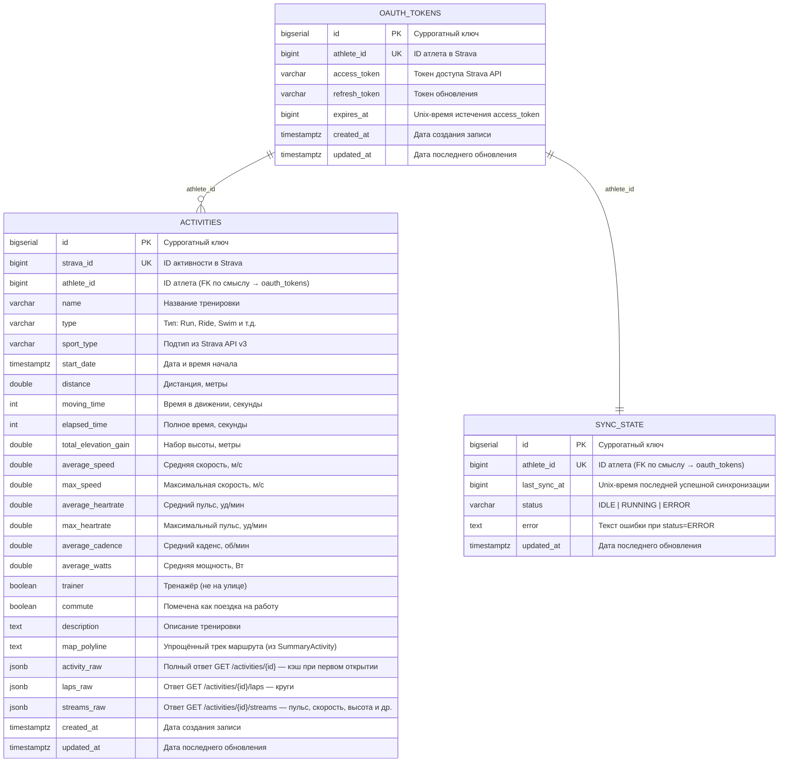

# Strava Dashboard

Персональный дашборд для визуализации активностей Strava.

## Возможности

**Главная страница**
- Переключение по годам и месяцам; клик на месяц фильтрует список активностей
- KPI-карточки: суммарный километраж и время по видам спорта за выбранный период
- Рекорды года: самая длинная поездка, наибольший набор высоты, самая быстрая средняя скорость, самое длинное плавание, самый долгий заплыв, самый длинный забег — только для видов спорта с активностями в году
- Мини-графики объёма по месяцам внутри каждой спортивной группы

**Детали активности** (открываются по клику на тренировку)

Четыре вкладки:
- **Обзор** — описание и 10 метрик (дистанция, время, скорость, пульс, каденс, мощность и т.д.)
- **Маршрут** — интерактивная карта на Leaflet с полным треком, полноэкранный режим
- **Круги** — таблица кругов с темпом/скоростью, пульсом и каденсом
- **Графики** — временны́е ряды: пульс, скорость/темп, профиль высот, каденс, мощность (только велосипед)

Данные для вкладок «Маршрут», «Круги» и «Графики» загружаются из Strava лениво при первом открытии и навсегда кэшируются в БД — повторные открытия не тратят API-запросы.

- **Прямая ссылка на тренировку** — при открытии модала URL меняется на `?activity={stravaId}`. Кнопка 🔗 в шапке копирует ссылку в буфер. По прямой ссылке страница сразу открывает нужную тренировку.

## Стек

- **Backend**: Java 21, Spring Boot 4, PostgreSQL, Flyway
- **Frontend**: React 19, Recharts, Tailwind CSS 4, Vite

## Требования

- Java 21+
- Docker (для PostgreSQL)
- Node.js 18+
- Аккаунт Strava + зарегистрированное приложение на [strava.com/settings/api](https://www.strava.com/settings/api)

## Запуск

### 1. База данных

```bash
docker compose up -d
```

### 2. Backend

Задать переменные окружения в Run Configuration (IntelliJ) или в терминале:

```bash
export STRAVA_CLIENT_ID=ваш_client_id
export STRAVA_CLIENT_SECRET=ваш_client_secret
./mvnw spring-boot:run
```

### 3. Авторизация Strava

Открыть в браузере: http://localhost:8080/auth/strava

После авторизации токен сохранится в БД. Синхронизация активностей запустится автоматически на следующем срабатывании джобы (в течение часа) либо немедленно через `POST /api/sync/full`.

### 4. Frontend

```bash
cd frontend
npm install
npm run dev
```

Открыть: http://localhost:5173

## Настройки Strava API

При регистрации приложения на strava.com/settings/api указать:

- **Authorization Callback Domain**: `localhost`

## Переменные окружения

| Переменная | Описание |
|---|---|
| `STRAVA_CLIENT_ID` | Client ID приложения Strava |
| `STRAVA_CLIENT_SECRET` | Client Secret приложения Strava |
| `STRAVA_REDIRECT_URI` | URI редиректа после авторизации (по умолчанию `http://localhost/auth/callback`) |
| `SHOW_ACTIVITY_MAP` | Показывать карту маршрута в деталях активности (по умолчанию `true`). Встраивается в сборку фронтенда, требует пересборки образа. |

## Схема БД



Связи логические — FK-ограничений нет, т.к. приложение однопользовательское.

## API

### Авторизация

| Метод | Путь | Описание |
|---|---|---|
| `GET` | `/auth/strava` | Редирект на страницу авторизации Strava |
| `GET` | `/auth/callback?code=...` | OAuth callback, сохраняет токен и запускает синк |
| `GET` | `/auth/success` | Страница подтверждения авторизации |

### Активности

| Метод | Путь | Параметры | Описание |
|---|---|---|---|
| `GET` | `/api/activities` | `page=0`, `size=20` | Список активностей с пагинацией |
| `GET` | `/api/activities/{stravaId}` | — | Детали активности; при первом запросе лениво загружает и кэширует полный ответ Strava (`activity_raw`, `laps_raw`) |
| `GET` | `/api/activities/{stravaId}/streams` | — | Временны́е ряды активности; при первом запросе лениво загружает и кэширует стримы (`streams_raw`) |
| `GET` | `/api/athlete` | — | Имя и аватар атлета (из Strava) |

### Статистика

| Метод | Путь | Параметры | Описание |
|---|---|---|---|
| `GET` | `/api/stats/summary` | — | Суммарные показатели по всем активностям |
| `GET` | `/api/stats/weekly` | `weeks=12`, `type=` | Объём по неделям (км), фильтр по типу |
| `GET` | `/api/stats/monthly` | `months=6` | Объём по месяцам (км) |
| `GET` | `/api/stats/pace` | `type=Ride`, `limit=30` | Тренд скорости/темпа по активностям |
| `GET` | `/api/stats/breakdown` | — | Разбивка по типам активностей |

### Синхронизация

| Метод | Путь | Описание |
|---|---|---|
| `GET` | `/api/sync/status` | Статус последней синхронизации |
| `POST` | `/api/sync/full` | Полный пересинк всех активностей из Strava |

## Логика синхронизации активностей

Приложение загружает активности из Strava в два режима.

**Первый запуск (пустая БД)**

Если в базе ещё нет ни одной активности, джоба отправляет запрос к Strava с `after=0` — Strava возвращает все активности атлета. Это происходит автоматически при первом срабатывании джобы после авторизации.

**Инкрементальная синхронизация (каждый час)**

`StravaPoller` запускается раз в час (`fixedDelay = 3600s`). В качестве параметра `after` передаётся `start_date` самой последней тренировки в БД (`MAX(start_date)`). Strava возвращает только активности, начавшиеся позже этой даты. Загрузка идёт постранично (50 записей), дубликаты обрабатываются через upsert по `strava_id`.

**Тренировка с более ранней датой**

Если в Strava появилась тренировка с датой начала _раньше_ последней тренировки в БД (загружена задним числом, импортирована с GPS-трекера и т.п.) — автоматически она не подхватится, так как её `start_date` окажется меньше значения `after`. В этом случае нужно запустить полный пересинк вручную:

```bash
curl -X POST http://localhost:8080/api/sync/full
```

Полный пересинк использует `after=0` и загружает все активности заново, не удаляя существующие данные.

## Логика ленивого кэширования деталей

При синке из Strava загружается только `SummaryActivity` — сводка активности без кругов, стримов и полного трека. Детальные данные загружаются лениво при первом открытии тренировки и сохраняются в БД навсегда.

| Триггер | Strava API | Что сохраняется |
|---|---|---|
| Первое открытие тренировки | `GET /activities/{id}` | `activity_raw` (полный `DetailedActivity`), `laps_raw` (круги), `description` |
| Первый переход на вкладку «Графики» | `GET /activities/{id}/streams` | `streams_raw` (пульс, скорость, высота, каденс, мощность) |

После кэширования повторные запросы к Strava не выполняются. Синк (`StravaPoller`) не перезаписывает закэшированные поля.

**Полный пересинк** (`POST /api/sync/full`) обновляет только поля из `SummaryActivity` (метрики, дистанция, время и т.д.) — `activity_raw`, `laps_raw` и `streams_raw` остаются нетронутыми.

## Деплой на сервер

### 1. Настройка Strava API

На [strava.com/settings/api](https://www.strava.com/settings/api) указать продовый домен:

- **Authorization Callback Domain**: `yourdomain.com`

### 2. Переменные окружения

Создать `.env` рядом с `docker-compose.yml`:

```env
STRAVA_CLIENT_ID=ваш_client_id
STRAVA_CLIENT_SECRET=ваш_client_secret
STRAVA_REDIRECT_URI=https://yourdomain.com/auth/callback
```

### 3. docker-compose

Поменять порт фронтенда (порт 80 занят реверс-прокси):

```yaml
frontend:
  ports:
    - "8081:80"   # любой свободный порт
```


### 4. Запуск

```bash
git pull
docker compose up -d --build
```

После запуска авторизоваться: `https://yourdomain.com/auth/strava`

## Справочник Strava API v3

Базовый URL: `https://www.strava.com/api/v3`  
Авторизация: `Authorization: Bearer <access_token>`

### Лимиты запросов

| Окно | Лимит |
|---|---|
| 15 минут | 100 запросов |
| Сутки | 1 000 запросов |

### OAuth-скоупы

| Скоуп | Доступ |
|---|---|
| `read` | Публичные данные профиля |
| `read_all` | Приватные данные профиля |
| `profile:read_all` | Полный профиль атлета (FTP, вес, снаряжение) |
| `activity:read` | Активности с видимостью «все» и «подписчики» |
| `activity:read_all` | Все активности включая приватные |
| `activity:write` | Создание и редактирование активностей |

---

### Атлет

#### `GET /athlete`
Профиль текущего атлета. Скоуп `profile:read_all` даёт полное представление, иначе — сводное.

**Ответ (DetailedAthlete):** `id`, `firstname`, `lastname`, `city`, `country`, `sex`, `premium`, `ftp`, `weight`, `bikes[]`, `shoes[]`, `follower_count`, `friend_count`

---

### Активности

#### `GET /athlete/activities` — список активностей
Возвращает массив `SummaryActivity`. Скоуп `activity:read`.

| Параметр | Тип | Описание |
|---|---|---|
| `before` | Integer | Unix-timestamp — активности до этого момента |
| `after` | Integer | Unix-timestamp — активности после этого момента |
| `page` | Integer | Страница (по умолчанию 1) |
| `per_page` | Integer | Записей на странице (по умолчанию 30, макс 200) |

**SummaryActivity** содержит: все поля из таблицы `activities` плюс `start_date_local`, `timezone`, `utc_offset`, `start_latlng`, `end_latlng`, `kilojoules`, `has_heartrate`, `workout_type`, `elev_high`, `elev_low`, `pr_count`, `suffer_score`, `visibility`, `map.summary_polyline`

#### `GET /activities/{id}` — детали активности
Полное представление `DetailedActivity`. Скоуп `activity:read`; для приватных — `activity:read_all`.

| Параметр | Тип | Описание |
|---|---|---|
| `include_all_efforts` | Boolean | Включить все отрезки сегментов |

**Дополнительно к SummaryActivity:** `calories`, `weighted_average_watts`, `description`, `gear`, `segment_efforts[]`, `splits_metric[]`, `splits_standard[]`, `laps[]`, `photos`, `device_name`

#### `GET /activities/{id}/laps` — круги
Массив `Lap`: `id`, `elapsed_time`, `moving_time`, `distance`, `average_speed`, `max_speed`, `average_heartrate`, `max_heartrate`, `average_cadence`, `average_watts`, `total_elevation_gain`, `lap_index`, `pace_zone`

---

### Streams (временны́е ряды)

#### `GET /activities/{id}/streams`
Детальные метрики активности с шагом 1 секунда. Скоуп `activity:read`.

| Параметр | Тип | Описание |
|---|---|---|
| `keys` | String (через запятую) | Типы стримов (см. ниже) |
| `key_by_type` | Boolean | Должен быть `true` |

**Доступные типы стримов:**

| Ключ | Единица | Описание |
|---|---|---|
| `time` | сек | Секунды от старта |
| `distance` | м | Расстояние от старта |
| `latlng` | `[lat, lng]` | Координаты |
| `altitude` | м | Высота над уровнем моря |
| `velocity_smooth` | м/с | Сглаженная скорость |
| `heartrate` | уд/мин | Пульс |
| `cadence` | об/мин | Каденс |
| `watts` | Вт | Мощность |
| `temp` | °C | Температура |
| `moving` | bool | Движение/пауза |
| `grade_smooth` | % | Уклон |

**Формат ответа:**
```json
{
  "heartrate": { "data": [142, 145, 148, ...], "series_type": "time", "resolution": "high" },
  "time":      { "data": [0, 1, 2, ...] }
}
```

#### `GET /segment_efforts/{id}/streams`
Стримы для отдельного отрезка сегмента. Скоуп `activity:read_all`. Параметры аналогичны стримам активности.
